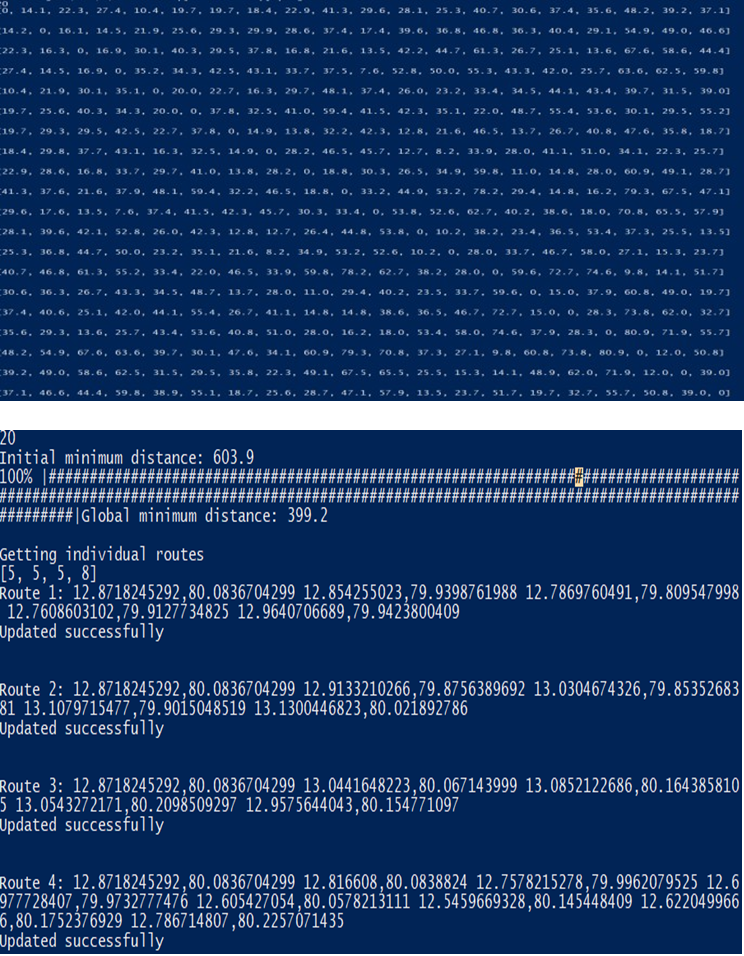

# Route Optimization Application using Server-Client Architecture and Google APIs
Have a look at out [research paper](https://ieeexplore.ieee.org/document/8991347) to understand this project in depth.

> **Concept:** I have an Station Office with 15 travellers. Every traveller has to visit some locations to provide their service.
> I have 60 locations that needs to be visited. Simplest way to assign 4 to each right?
>
> **WRONG!!**
>
>How much they are spending
> on their travel, are they going through the same path while they are going to the next location and are some travellers travelling
> more than others? Who will answer it? 
>
> **Answer 😛:** The Station manager can set the location and assign 2-all of his travellers for the task using Android apps deigned for it.
> Then use the Python script for calculating the perfect routes and the number of locations for the assigned travellers.
> The travellers can use another Andoid app to track their routes and direction.

There are 3 parts to this:

1. The backend --> PHP APIs.
 * Host the `TSP APP` folder in any of he PHP & MYSQL Supported web hosting services, I prefere [000webhost](https://www.000webhost.com/).
 * Change the database config fom the `connection.php`.
 * Make sure you have a databse name `tspapp`
 * Run / visit the `init.php` site, it will prepare the databases for the project.
 * Insert some traveller info by visiting **UserInsertPage.php** , atleast 10 to start from.
 

2. Midware --> Python & Genetic Algorithm. I would like to extend my gratitude to [Anupal](https://github.com/Anupal/) for his research paper and the implementation of [Genetic Algorithm for MTSP](https://github.com/Anupal/GA-for-mTSP). Some scripts were created and most of them were edited to fit this particular application tho.
 * In `connection.py` change **YOUR_DOMAIN_NAME** to wherever you hosted the backend and the `station name` to whichever station you want
 to calculate routes for.
 * Run the `Run.py` and enjoy the show 😏.

> It uses the Distance Matrix (a.k.a Adjecency Matrix) prepared by the TSP Android app to calculate the shortest equal routes for all
> the travellers in that station. These are direcy updated in the database.

 
3. Frontend --> Android Apps.
 * Get an API KEY with `Google Map API`, `Places API`, `Places Auto Complete API`, `Distance Matrix API`, `Direction API` and `Geolocate APIs` are enabled
 * Replace **YOUR_API_KEY** with your obtained API_KEY from the `Manifest.xml` file from all the apps except the **_OfficeAttendace_** app
 * Replace **YOUR_API_KEY** with your obtained API_KEY from `DistanceFetch.java` in **_TSP_** app and in `MainActivity.java` on the **_OfficeApp_.
 * Replace **YOUR_DOMAIN_NAME** with your hosted domain in the `MainActivity.java` all the apps except the office **_OfficeApp_** where you need to make the same change in `login.java` file.
 
App Instructions:

1. TSP App: To celculate the Adjecency Matrix
 * Enter the station name first. 
 * Tap and hold on the locations that you want.
 * Proceed with those locations till a page will come where it will say *Click to calculate Distance Matrix*, **DO AS IT SAYS..**
 
 

2. Offcie Attendance App
 * Enter the Id of the traveller, and it will appear, select all you need and not all you have.
 * slect which station you want to assign them.
 
 

3. Map Direct app
 * Traveller will login with their ID and Password.
 * `Leaving office` button : Pretty self explained.
 * `Reached Location` button : When you reach the location you're supoosed to visit.
 * `Proceed to next` button : To get the next location when you have visitd the nect location.
 * `Done for the day` button : When the traveller wants to leave early and  his route incompltete, or has completed his route.
 
 
 
4. Office App
 * Just to monitor every person from every station. (Spy 😎)
 
 
